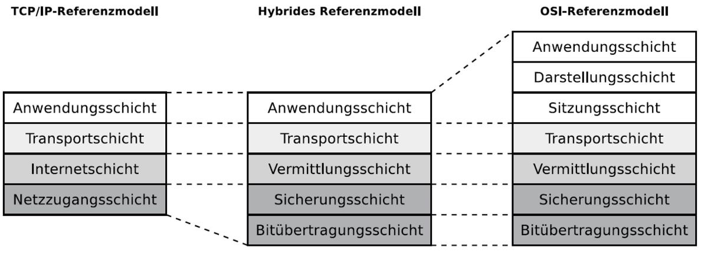
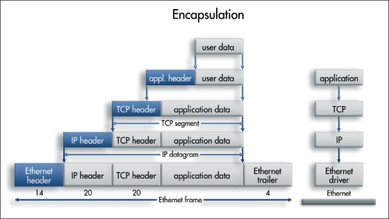

# Network Basics

Mandatory video:

<iframe width="769" height="527" src="https://www.youtube.com/embed/3uhA8bdz8gI" title="YouTube video player" frameborder="0" allow="accelerometer; autoplay; clipboard-write; encrypted-media; gyroscope; picture-in-picture" allowfullscreen></iframe>

The general differentiation between networks happens in an area sense of way.

#### PAN:
Personal area network, personal devices over short distances like for example over cables (USB), wireless (bluetooth - subcategory Piconet) or simply PDAs.
#### LAN:
Local area network, usually over ethernet or wifi. Mostly home- and companynetworks.
#### MAN:
Metropolitan area network, the network gets bigger and encompasses one or more cities.
#### WAN:
Wide area network, network over large distances.
#### GAN:
Global area network. The terms WAN and GAN are normally used interchangably, because the line between the differentiations blurres. WAN is usually the internet (see also windows adapter setting "connect to WAN").

### Latency
Latency is the time measured between packets sent and received. If it takes 80ms for a packet to arrive at its destination, the latency is 160ms (forth and back).

## Network reference models
The three typical reference models used are the ISO/OSI-, TCP/IP- and the Hybdrid-reference models.

The reference models cover the whole process network packets take from the sending to the receiving application. The process starts at the top-most layer, where the user/applicationdata is present. This data then gets encapsulated more and more as it "traverses" all the layers until it is send via the wire or wifi (electromagnetic waves/photons). 

Sidenote: Don't mix this up with broadcast medias. The wire is usually copper or fiber (glasfaser, also photons) or just photons. The transport media for wifi is not air (sound), as it works in a vacuum too!

Each layer adds data for one or more components to ensure the packet reaches its destination. Looking at the ISO/OSI-model, from bottom to top:

1. Physical layer (wifi or cable), binary data is sent, 1 and 0.
2. Data-Link layer, the frame is created. The frame encapsulates the paket and only adds information for the next devices it needs to reach (see MAC-address).
3. Network layer, this is where IP-information is added. Used by routers to determine where it needs to send pakets. 
4. Transport layer, for ex. TCP or UDP. The TCP protocol defines that information is critical and ensures all data sent is also received properly. Websites work that way, as every component needs to load for it work as intended. UDP on the other hand can drop information, used in voice communication or streaming.
5. Session layer, manages the session, used for authentication, authorization and session restoration.
6. Presentation layer, used for data conversion, compression, encryption etc..
7. Application layer, the application that sends and receives packets. For example DNS, HTTP, DHCP.. This is the payload (Nutzdaten).

## TCP/IP Layer 1 (ISO/OSI Layer 1&2)
Packets will be encapsulated with additional information and are considered frames.

### MAC-Address
MAC stands for **M**edia **A**ccess **C**ontrol and is also called a hardware-address.
It's basically the layer 2 equivalent to the IP-address. A mac address looks like this: 00:50:56:b8:6b:26. Its written in hexadecimal (0-F) and consists of 48-bits (4bits*12).

Question: How many different MAC-addresses exist with 48bit?

  
Answer

Answer: 2^48 -> 281’474’976’710’656

MAC-addresses are usually unique. The first half is vendor specific and doesn't change, so it's possbile to identify the vendor by this address. Adresses gets reused if the vendor passes FF:FF:FF, the next device starts at 00:00:00 again. They are used to address the devices in layer 2 fashion so if multiple devices with the same MAC exist in the same L2 network, only one will receive the frame (see ARP for more information on why). 

A switch operates on this layer and has an ARP-table, where it saves the port and the corresponding MAC-address of the device thats connected via that port. When a switch receives a packet, it only needs to check the L2 data (frame) to know where it has to send the packet next. 

Sidenote: There are also Layer-3-Switches, which can read IP-addresses and route between network. They are usually used for vLans (virtual LANs), more on this later.

Task: Check the MAC-Address for the device you're currently using.

Question: Which devices that communicate with the TCP/IP reference model use MAC-Addresses?

## TCP/IP Layer 2 (ISO/OSI Layer 3)
More data gets added to the packet to determine its intended destination.
### IP-Address
The **I**nternet **P**rotocol address is the endpoint across mutliple networks. This information is needed when networks get combined via routers. A router connects networks by their subnets (see network notations) and knows where to send it next. IP-addresses exist in the version IPv4 and IPv6, where IPv6 is the newer standard (released 1998) and adds a lot of functionalities. It's not widely used in LANs because the old IPv4 notation is better readable for humans.

IPv4 example: 192.168.0.1
IPv6 example: ::ffff:c0a8:1
expaneded IPv6: 0000:0000:0000:0000:0000:FFFF:C0A8:0001

Question: How many unique IPv4 addresses exist?

  
Answer

  Answer: 2^32 -> 4’294’967’296

Question: How many unique IPv6 addresses exist?

Answer: 2^128 -> 3.4028236692093846346337460743177 * 10^38

More on IPv6: http://www.steves-internet-guide.com/ipv6-guide/

A network consisting only of a switch an 2 hosts is theoretically enough to function. Still, packets have to go through layer 3 and get an IP-address attached. If the endpoint receives a packet that doesn't match it's configured IP-address, it will drop (delete) the packet. Do mitigate this "problem", Link-Local-Addresses exist. In IPv4 these addresses are also called APIPA-addresses and range from 169.254.1.0 to 169.254.254.255. These addresses are auto-configured by the OS when no IP-address is configured or no DHCP Server is around.

Question: Whats the range of Link-Local-Addresses in IPv6?

  
Answer

Answer: 

## TCP/IP Layer 3 (ISO/OSI Layer 4)
This is the transport layer where the transportation protocol is used, most of the time either TCP or UDP. 

")

### TCP Handshake

ToDo:...

## TCP/IP Layer 4 (ISO/OSI Layer 6,7,8)
The application layer. Usually the software controls all these steps, so in the TCP/IP model these layers are summarized. Common protocols of these layers are DNS, DHCP, http, ssh etc., more on those later.

### Layer 8
Human. Ever heard of layer 8 error ;-) ?
