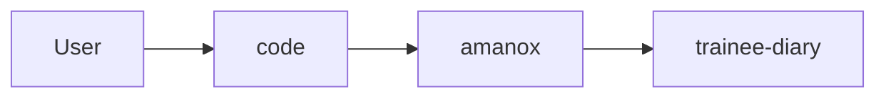

## Overview

Welcome to the team I wish you a great start and time at our company ❤️
In this post I will guide you on the setup of your trainee diary. 
In a later post I will share with you a guide and my expectations.
If you have any questions or you are stuck at something just get in touch with me.
Looking forward to work with you and no worry if you don't really understand everything which will be going on in this tutorial.
If you want to copy or use something of my blog post feel free to do it though attribution is appreciated.✌🏿



## Requirements
Befor you start make sure you fullfill all the requirements to start this guide otherwise it can cause problems.


<input type="checkbox"> 👉 Download a Packet Manager [For Windows](https://chocolatey.org) |[for Mac](https://www.brew.sh) 


<input type="checkbox"> 👉  [Have something where you can store you passwords](https://vault.bitwarden.com/#/register)


<input type="checkbox"> 👉 Have some portrait of you ready


<input type="checkbox"> 👉 [Create a Github account](https://www.github.com/join)


<input type="checkbox"> 👉 [Link your Github account with a Netlify account](https://app.netlify.com/signup) 


<input type="checkbox"> 👉 [Create a Gravatar/Wordpress account](https://en.gravatar.com) 


<input type="checkbox"> 👉 [Create a LinkedIn account](https://linkedin.com/signup) 


<input type="checkbox"> 👉 Have an editor or IDE installed an be familiar with [I recommend Visual Code](https://code.visualstudio.com) 


So now that you have everything let's start.

## Installation of Chocolatey
This part is only interesting for windows user.
Go to your search and tipp in **Windows Powershell** and then open it as an Administrator.


Then copy paste the following command into powershell.
```powershell
Set-ExecutionPolicy Bypass -Scope Process -Force; [System.Net.ServicePointManager]::SecurityProtocol = [System.Net.ServicePointManager]::SecurityProtocol -bor 3072; iex ((New-Object System.Net.WebClient).DownloadString('https://chocolatey.org/install.ps1'))
```
Use this to check if everything went fine.
```bash
choco
```

## Installation
First of all you need to [fork the Repo from wowchemy](https://app.netlify.com/start/deploy?repository=https://github.com/wowchemy/starter-academic&stack=cms).

After clicking on the link, you'll be greeted with the welcome screen.


Click the big Connect To Github button on the welcome screen (or alternatively click the link underneath to connect with Gitlab):


Login with your Github account 


Click Save & Deploy to create a repository for your site in Github:


Netlify will now generate your new site. Generally this takes around 1 to 5 minutes, but can take longer during busy periods. You’ll see the green “Published” notice appear under Production Deploys once it has completed.


You’ll notice that Netlify assign a free, random URL to the site. Let’s customize the URL to something more relevant. First click Site Settings:


Click Change site name…


Enter your site’s name, such as your name or organisation name, separating words with a hyphen (-) rather than a space.

Lastly, click Save to update our Netlify subdomain.

Awesome! We can now visit the site at the URL you chose!
Check your (GitHub) email to accept the invite to edit your site in the admin panel:


{}
If you can’t find the email,
* Go to **Settings > Identity**, and select **Enable Identity** service
* Under **Registration** preferences, select **Invite Only**
* Scroll down to **Services > Git Gateway**, and click **Enable Git Gateway**
  * This allows editors to write content without needing a GitHub account
* Head to the **Identity** tab at the top of the Netlify dashboard and then click the **Invite Users** button to invite yourself by entering your email address
{}

You will then be prompted to create a password:


Now you’re ready to edit your site in the CMS:


## Clone the Repository on your machine

Now let's get our hands dirty with git. Git is version control system and their are many Solutions out there to name a few Github, Gitlab, CodeCommit, etc. Initialy it was created by **Linus Torvald** (Father of Linux kernel) to help him and other people to collaborate on the development of the kernel code. The base software is open source. Git is widley used in the opensource community anyhow it is a basical skill which you will likely face at one point if you work in IT. So if you hear commit, branch, fork or repository it is always related to git.

Log you into your Github account and check if there was a new repository created. 
You should see something like <githubAccountNme/ogithubOrganizationName>/<repositoryname>


Next you should open an command line tool on your pc.


 On mac open the terminal and type in the following command:
```sh
homebrew install git golang hugo
```
{}
If you should use an mac with the new M1 you need to install go this way.
```sh
arch -arm64 brew install go       
```
{}
  On windows open powershell
```bash
choco install git golang hugo -confirm
```
After this steps all required tools are installed. But you can also install the [Github Desktop Version](https://desktop.github.com)
I recommend you to master the command line it is more convinient and indepentent. The next step will be to create an folder on your pc where we store our repositories.


Into your Github account navigate now into the newly created repository and copy the clone Link of the repository we will need it to create a local copy of the repository on your machine.


Now you go back to your already open console.
The following command are creating a simple folder structur in your user directory.

```bash
cd ~
mkdir code
cd code
mkdir amanox
cd amanox
git clone <Link to your repo>
```
{}
Passwordbased authentication for Github is deprecated so you need to generate an PAT (Personal Access Token)
and use it like a password.
[You can follow this tutorial here](https://docs.github.com/en/github/authenticating-to-github/keeping-your-account-and-data-secure/creating-a-personal-access-token)
Make sure you store it also in Bitwarden or the password tool of your choice.
{}

You can also choose a different structure if it fits your need better it is just a proposal.
Congrats you finished this part. 🙌
## Setup your CV
Open now **visual Code** an click on "open Folder"



Next you navigate to your Repository and open it.

{}
The root directory is the **first or top-most directory in a hierarchy**. It can be likened to the trunk of a tree, as the starting point where all branches originate from.
{}

The you should see a screen like this:

Now we are ready to edit trainee diary how we want.

### Remove unused parts

The first step that we will do is to get ride of all the stuff that we are not going to use. Here we have to possibilties how we can achieve this.
1. We can disable the unused parts with the active attribute.
2. We can delete the unused parts
I will go with the first option so i navigate into _content/home/_ where you can disable the following files _publications.md_ & _talks.md_ and type in the following code on the second line:
```markdown
active: false
```
The next step is to also remove the link from the navigation bar. Navigate to from your root foler to _config/_default/menus.yaml_ an in this file you remove the unwanted part. Then your file should look like this.
```markdown
main:
  - name: Home
    url: '#about'
    weight: 10
  - name: Posts
    url: '#posts'
    weight: 20
  - name: Projects
    url: '#projects'
    weight: 30
  - name: Contact
    url: '#contact'
    weight: 40
```
Befor you now can see some effect of your work you need to save your files and then make a local git commit and push it to the github repository. To do that use the following commands:
```bash
git add --all
git commit -m "My First commit"
git push
```
{}
It is always a good idea to give your commit an selfexplaining description so if you would need to go back or someone else wants to understand what you change it is self explaining which saves a lot of time.
{}
After you pushed your changes to the github repository lets login into our github account and check if everything worked out as planned.
In the red box you see the description of the last commit of the repository.

After that we can go to netlify to check if our changes go actual published to the world wide web.
If you didn't broke the syntax everything should be fine if you got an failure check if there is no typo in your files.
After you push a change you need to wait for 1-2minutes until it is live.

If you now access your page and scroll throw it you will see the content disappeared.

The next thing is to delete the demo post which is prebuild in our blog to do that we need to delete the following files you can delete it over the shell with the following command as you can see we can also manipulate the filesystem without the need of a mouse click. 
{}
Attention if you chose the wrong folder it will delete everything in this folder so be sure to chose the right one.
Be sure to start in the root directory of your project.
{}
```sh
rm -r content/post/getting-started
git add --all
git commit -m "Removed demo post"
git push
```
If you wan't you can check the result as you can see in this image below my demo post is gone on my diary.



You are awesome and finished the first part.🙌

### Edit the configuration of the webpage
In this part we are going to fill out your contact details, edit the localization and do some fine tuning.
So first you open again Visual Code and navigate to _config/default_ and open the _config.yaml_ file.
{}
_.yaml_ means **Yet Another markdown Language** mostly this files are used for configuration were data needs to be stored or transmitted.
It is also used to store a data structure or object stata which can later be processed. In yaml files the indentation is essential so keep an eye on that.
{}
When you open the file you will see a lot of option in the form of a key value pair. What do i mean with key value pair you might ask yourself.
Let's look at my example the _key_ title: which has the _value_ Portfolio so basically it it's a normal setting. 
Now we are going to change some of this _values_ or even add a complet _key/value pair_.
First thing we are going to change it the title of our site.
```yaml
title: Trainee diary
```
Next step is to also change the url to actual match your webpage. This is the url you defined in Netlify.
After that we are finished with this file.
```yaml
baseurl: <name>.netlify.app
```
Open now the _params.yaml_ file in this files you found everything which is strongly related to the wowchemy theme that we are using.
As a first step I you should update your contact details here. You should be able now to change that by yourself.
I still give you my code snippet as an example:
```markdown
# Contact (edit or remove options as required)

email: fabian.brunner@windowslive.com
phone: +41 79 266 20 63
address:
  street: Dammweg 9
  city: Bern
  region: BE
  postcode: '3013'
  country: Switzerland
  country_code: CH
coordinates:
  latitude: '46.95639'
  longitude: '7.44676'
directions: Enter the Building and take the stairs to the Office on Floor 3
office_hours:
  - 'Monday-Friday 09:00 to 17:00'
appointment_url: 'https://calendly.com/fabian-brunner'
contact_links:
  - icon: twitter
    icon_pack: fab
    name: DM Me
    link: 'https://twitter.com/Twitter'
  - icon: discord
    icon_pack: fab
    name: Discord
    link: 'SwissFabru #4554'
```
After we filled out our contact details we are going to customize the localization of your wepage.
Look for the following key and change their values accordingly.
```markdown
# Localization

date_format: 'Jan 2, 2006'
time_format: '15:04 CET'
address_format: de
```

Last put not least we are going to change the site feature settings. I summarized everything i changed in this code snippet.
Search your file with the shortcut on your keyboard, press the keys _ctrl_ + _f_ and type in the key which you are looking for.
```markdown
highlight_languages:
  - r
  - bash
  - shell
  - powershell
  - markdown
  - css
  - javascript
  - yaml
diagram: true
show_related:
  book: true
  page: false
  post: true
  project: true
  publication: false
  event: false
avatar:
  gravatar: true
  shape: circle
```
If you ask yourself what are these options all doing let me give you a brief explanation.
- The **highlight_languages** is were you can define which languages are marked and highlighted according to the language they belong to.
I used this featured a lot in this post thats all these tiny code sektion that i made for you.

- With the **diagram** option I enable you to use mermaid diagrams it is kind of a markdown language which is generating diagrams.
- **show_related** defines which kind of recommendations you get in the footer of a post. Because we disabled some of these feature we also disable them in the recommendation.
- With the **gravatar** option we enable you to use the profile picture of gravatar.

{}
Don't forget to save your changes an then make a commit if you want to see it.
```bash
git add --all
git commit -m "Changed configuration files"
git push
```
{}

Finally let's take a look at our changes go to your webpage on _Contact_ and see if something changed.
If everything worked out you should see now your contact details on the page.

Congratulation you also finished this part.🙌

### Add your portrait and biography
Now we would like to edit the following part of our webpage.

To edit this part we need to navigate to _content/authors/admin_ and open the **_index.md** file.
If you want to use the gravatar profile picture we need to calc the hash of our mail adress that we used for gravatar.
You can do it like this:
```bash
echo -n fabian.brunner@windowslive.com | md5
```

Then you copy the output and add it to the end of this link _https://www.gravatar.com/avatar/_ with that your webpage will be able to call the gravatar api.
The rest you can look up in my example markdown file.
Here you can start to edit everything as needed. I also put in my code as an example:
```markdown
---
role: Cloud Engineer
avatar_filename: https://www.gravatar.com/avatar/1a32b4e8c526b48a93433a6ff692d809
bio: My research interests include AWS, IaC and HybridCloud.
interests:
  - AWS
  - IaC
  - HybridCloud
social:
  - icon: envelope
    icon_pack: fas
    link: /#contact
  - icon: twitter
    icon_pack: fab
    link: https://twitter.com/nutaboy
  - icon: github
    icon_pack: fab
    link: https://github.com/nutaboy
  - icon: linkedin
    icon_pack: fab
    link: https://www.linkedin.com/in/fabian-brunner-699284133/
organizations:
  - name: Amanox Solutions AG
    url: https://www.amanox.ch
education:
  courses:
    - course: "BSc in Computer Science "
      institution: Fachhochschule und Nordwestschweiz FHNW
      year: ""
    - course: Berufsmatura
      institution: Gewerblich-Industrielle Berufsfachschule Solothurn
      year: ""
    - course: Swiss Federal Certificate of Proficiency
      institution: Gewerblich-Industrielle Berufsfachschule Solothurn
      year: ""
superuser: true
highlight_name: false
title: Fabian Brunner
email: "fabian.brunner@windowslive.com"
---
Fabian Brunner is a Cloud Engineer at Amanox Solutions in Switzerland. His responsibilities are to manage to internal IT of Amanox and to guide his customer to success in the AWS cloud. During this journey he supports the customer with coding and other challenges. He likes to build microservice based solutions and try out new technologies.

In his freetime he like to hike in the Swiss mountains or play football. When he is not on the football pitch or the mountains he like to play some indie computer games.


 Download my resumé.
```
When you edit everything as wished you can then push everything to the Github repository and see if the conent on your webpage changed.

You made to the end of this part congratulation.

### Add your skills
So far we mostly worked with so called widgets. These are kind of prebuild modules which we can use. For the skill part this widget doesn't fullfill our needs.
Because we want kind of cool skill bars which show our skills instead of boring icons.
Now we could create our own widget or use html code directly for now we will stick with the second option.
Blank html, thats no problem because we can then use the blank widget which allows us to write direct html code into the .md file.(It is also possible in the prebuild widgets it is just not so clean🤫)


The First step is to navigate into the following directory _content/home_ and there you open the file _skills.md_
Then you will delete the following lines of code.
```markdown
# Showcase personal skills or business features.
- Add/remove as many `feature` blocks below as you like.
- For available icons, see: https://wowchemy.com/docs/page-builder/#icons
feature:
- description: 90%
  icon: r-project
  icon_pack: fab
  name: R
- description: 100%
  icon: chart-line
  icon_pack: fas
  name: Statistics
- description: 10%
  icon: camera-retro
  icon_pack: fas
  name: Photography

# Uncomment to use emoji icons.
#- icon: ":smile:"
#  icon_pack: "emoji"
#  name: "Emojiness"
#  description: "100%"  

# Uncomment to use custom SVG icons.
# Place custom SVG icon in `assets/images/icon-pack/`, creating folders if necessary.
# Reference the SVG icon name (without `.svg` extension) in the `icon` field.
#- icon: "your-custom-icon-name"
#  icon_pack: "custom"
#  name: "Surfing"
#  description: "90%"
```
Eventually we change the type of the part that we are editing, that we can achieve if we change _widget:_ from _featurette_ to _blank_.
Afterwards we can start to work on our html code. But first what is html and what does it stand for. HTML stands for Hypertext Markup Language and is basically the base of the world wide web.
At the moment we are using version 5 which is compatible with all browsers. Mostly it will be assisted by other technologies like css and javascript. For our skillbar we will need to do some html and css.
CSS stands for Cascading Style Sheets the main responsibility for css is the presentation of the html parts. So css is like clothes for humans because affect as well our presentation layer.
When you use html you also need to use css or it will be very ugly. If we want to add custom css we can to that if we create a file with the _.scss_ extention under the following folder _assets/scss_.
If you search a challenge you can try to build these skillbars yourself with the help of [w3school](https://www.w3schools.com/howto/howto_css_skill_bar.asp) but you have to use only html and css to do it.
However if you still feel overhelmed than expand the next section and we build it up together.

The first step that we are going to do is to insert out html code. You can put your html code after the secone **---** in the file. 
Html always use <>tags we will mostly use the <div></div> tag to do our job. An HTML element is defined by a start <> tag, some content, and an end </> tag.
The HTML element is everything from the start tag to the end tag. There are some HTML elements have no content (like the <br> element). These elements are called empty elements. Empty elements do not have an end tag!
Let create our first tag and insert some text in it. You can push it an see how you skill part will no look like.
```html
 <div>AWS</div>
```

After that we will add a class to the element so that we can design it with css. Let's add the class skill-name to our div tag.

```html
<div class="skill-name">AWS</div>
```

If you now check our webpage you will see that nothing changed. We now need to add some css to see some effet for that we navigate to _assets/scss_ and create a file _custom.scss_
Css is syntax always starts with a so called selector which defines for which elements we want to change a design attribute. In our case we can choose the class with . and then we add the _classname_
behind that . if we don't use a . we can also select direct html elements. But i am pretty sure that there are other <div> elements in our webpage but we don't want to change them.
After we selected the right class we can define then inside of the {} different design option take a look at the css reference in [w3school](https://www.w3schools.com/cssref/) if you want to see some examples.
Copy now the following code into you _custom.scss_ and then save your code and push it to Github

```css
 .skill-name{
    font-size: 18px;
    font-weight: 700;
    text-transform: uppercase;
    margin: 20px 0;
  }
```

if your check now your webpage you will see that the font changed a bit.

The next thing that you can do is to add some color variable to your css file this will make changes in the future more easy to made.
I will share with you my variables if you want you can insert them into your css as well an use them with _var(--name)_ or define more of them.

```css
  :root{
    --blue: #007bff;
    --indigo: #6610f2;
    --purple: #6f42c1;
    --pink: #e83e8c;
    --red: #dc3545;
    --orange: #fd7e14;
    --yellow: #ffc107;
    --green: #28a745;
    --teal: #20c997;
    --cyan: #17a2b8;
    --white: #fff;
    --gray: #6c757d;
    --gray-dark: #343a40;
    --primary: #1565c0;
    --secondary: #6c757d;
    --success: #28a745;
    --info: #17a2b8;
    --warning: #ffc107;
    --danger: #dc3545;
    --light: #f8f9fa;
    --dark: #343a40;
    --breakpoint-xs: 0;
    --breakpoint-sm: 576px;
    --breakpoint-md: 768px;
    --breakpoint-lg: 992px;
    --breakpoint-xl: 1200px;
    --font-family-sans-serif: -apple-system, BlinkMacSystemFont, "Segoe UI", Roboto, "Helvetica Neue", Arial, "Noto Sans", "Liberation Sans", sans-serif, "Apple Color Emoji", "Segoe UI Emoji", "Segoe UI Symbol", "Noto Color Emoji";
  }
```

So that you know the basic concept a bit we will add some more html elemtents to the _skills.md_ file.
The base structure in my example looks like this. You just need to copy the section between the skills bracket so many times you like then you are fine.

```html
<div class="skills">

  <div class="skill">
    <div class="skill-name">Your First Skill</div>
    <div class="skill-bar">
      <div class="skill-per" per="90%" style="max-width:90%"></div>
    </div>
  </div>

</div>
```

After that we will need to adapt the css as well i don't want to go to much into detail if you are interested you can look it up.

```css
 .skills{
    width: 100%;
    max-width: 600px;
    padding: 0 20px;
  }
  
  .skill-name{
    font-size: 18px;
    font-weight: 700;
    text-transform: uppercase;
    margin: 20px 0;
  }
  
  .skill-bar{
    height: 14px;
    background: var(--light);
    border-radius: 3px;
    box-shadow: 5px 5px 10px var(--dark);
  }
  
  .skill-per{
    height: 14px;
    background: var(--primary);
    border-radius: 3px;
    position: relative;
    animation: fillBars 2.5s 1;
  }
  
  .skill-per::before{
    content: attr(per);
    position: absolute;
    padding: 4px 6px;
    background: var(--dark);
    border-radius: 4px;
    font-size: 12px;
    top: -35px;
    right: 0;
    transform: translateX(50%);
    color: var(--light);
  }
  
  .skill-per::after{
    content: "";
    position: absolute;
    width: 10px;
    height: 10px;
    background: var(dark);
    top: -20px;
    right: 0;
    transform: translateX(50%) rotate(45deg);
    border-radius: 2px;
  }
  
  
  @keyframes fillBars{
    from{
      width: 0;
    }
    to{
      width: 100%;
    }
  }
```



The skills.md file:
```markdown
---
# An instance of the Featurette widget.
# Documentation: https://wowchemy.com/docs/page-builder/
widget: blank

# This file represents a page section.
headless: true

# Order that this section appears on the page.
weight: 30

title: Skills
subtitle:
---
<div class="skills">

  <div class="skill">
    <div class="skill-name">AWS</div>
    <div class="skill-bar">
      <div class="skill-per" per="90%" style="max-width:90%"></div>
    </div>
  </div>

  <div class="skill">
    <div class="skill-name">Devops</div>
    <div class="skill-bar">
      <div class="skill-per" per="70%" style="max-width:70%"></div>
    </div>
  </div>

  <div class="skill">
    <div class="skill-name">Python</div>
    <div class="skill-bar">
      <div class="skill-per" per="60%" style="max-width:60%"></div>
    </div>
  </div>

  <div class="skill">
    <div class="skill-name">API</div>
    <div class="skill-bar">
      <div class="skill-per" per="80%" style="max-width:80%"></div>
    </div>
  </div>

  <div class="skill">
    <div class="skill-name">Nutanix</div>
    <div class="skill-bar">
      <div class="skill-per" per="50%" style="max-width:50%"></div>
    </div>
  </div>

</div>
```
The custom.sccs file:
```css
 :root{
    --blue: #007bff;
    --indigo: #6610f2;
    --purple: #6f42c1;
    --pink: #e83e8c;
    --red: #dc3545;
    --orange: #fd7e14;
    --yellow: #ffc107;
    --green: #28a745;
    --teal: #20c997;
    --cyan: #17a2b8;
    --white: #fff;
    --gray: #6c757d;
    --gray-dark: #343a40;
    --primary: #1565c0;
    --secondary: #6c757d;
    --success: #28a745;
    --info: #17a2b8;
    --warning: #ffc107;
    --danger: #dc3545;
    --light: #f8f9fa;
    --dark: #343a40;
    --breakpoint-xs: 0;
    --breakpoint-sm: 576px;
    --breakpoint-md: 768px;
    --breakpoint-lg: 992px;
    --breakpoint-xl: 1200px;
    --font-family-sans-serif: -apple-system, BlinkMacSystemFont, "Segoe UI", Roboto, "Helvetica Neue", Arial, "Noto Sans", "Liberation Sans", sans-serif, "Apple Color Emoji", "Segoe UI Emoji", "Segoe UI Symbol", "Noto Color Emoji";
  }
  
  .skills{
    width: 100%;
    max-width: 600px;
    padding: 0 20px;
  }
  
  .skill-name{
    font-size: 18px;
    font-weight: 700;
    text-transform: uppercase;
    margin: 20px 0;
  }
  
  .skill-bar{
    height: 14px;
    background: var(--light);
    border-radius: 3px;
    box-shadow: 5px 5px 10px var(--dark);
  }
  
  .skill-per{
    height: 14px;
    background: var(--primary);
    border-radius: 3px;
    position: relative;
    animation: fillBars 2.5s 1;
  }
  
  .skill-per::before{
    content: attr(per);
    position: absolute;
    padding: 4px 6px;
    background: var(--dark);
    border-radius: 4px;
    font-size: 12px;
    top: -35px;
    right: 0;
    transform: translateX(50%);
    color: var(--light);
  }
  
  .skill-per::after{
    content: "";
    position: absolute;
    width: 10px;
    height: 10px;
    background: var(dark);
    top: -20px;
    right: 0;
    transform: translateX(50%) rotate(45deg);
    border-radius: 2px;
  }
  
  
  @keyframes fillBars{
    from{
      width: 0;
    }
    to{
      width: 100%;
    }
  }
```


Congratulation you also finished this part now the most difficult parts are down.🙌
### add your experience
The next thing will be to add our experience in our CV to do that we will only use the widget function.
If you want the use the icon as i do in my example you need to save them in the _.svg_ format into the _/assets/media/icons/brands_ folder.
Or you can edit the widget to accept png as well but this you can do at a later stage. [Link to Solution](https://github.com/wowchemy/wowchemy-hugo-modules/discussions/2382)
For each expierence station you can add a new section like this under experience and fill out the information.
```markdown
  - title: 'Cloud Engineer / IT-Manager'
    company: 'Amanox Solutions AG'
    company_url: 'https://www.amanox.ch'
    company_logo: org-amanox
    location: 'Bern'
    date_start: '2018-06-01'
    date_end: ''
    description: |2-
        Responsibilities include:
        
        * Creation of concepts & architecture
        * technical implementation
        * trainings of groups
        * Budget responsibility
```

```markdown
---
# An instance of the Experience widget.
# Documentation: https://wowchemy.com/docs/page-builder/
widget: experience

# This file represents a page section.
headless: true

# Order that this section appears on the page.
weight: 40

title: Experience
subtitle:

# Date format for experience
#   Refer to https://wowchemy.com/docs/customization/#date-format
date_format: Jan 2006

# Experiences.
#   Add/remove as many `experience` items below as you like.
#   Required fields are `title`, `company`, and `date_start`.
#   Leave `date_end` empty if it's your current employer.
#   Begin multi-line descriptions with YAML's `|2-` multi-line prefix.
experience:
  - title: 'Cloud Engineer / IT-Manager'
    company: 'Amanox Solutions AG'
    company_url: 'https://www.amanox.ch'
    company_logo: org-amanox
    location: 'Bern'
    date_start: '2018-06-01'
    date_end: ''
    description: |2-
        Responsibilities include:
        
        * Creation of concepts & architecture
        * technical implementation
        * trainings of groups
        * Budget responsibility
        
  - title: 'Junior System Engineer'
    company: 'Regio Energie Solothurn'
    company_url: 'https://www.regioenergie.ch'
    company_logo: org-regio
    location: 'Solothurn'
    date_start: '2016-01-01'
    date_end: '2020-12-31'
    description:  |2-
        Responsibilities include:
        
        * Support and Operation of public schools of the city solothurn
        * network design mainly based on WiFi
        * training of teachers
        * leadership of small team
```

If pushed your changed you experience part should look something like this then.


Congratulation you made it to the end of this section.
### add your accomplishments
Now you are more or less at the end of setting up your CV. Try to make use of the accomplishments section by yourself.
Take help of the [Documentation of wowchemy](https://wowchemy.com/docs/content/docs/) or ask your collegue.
You should be able to do it it is very smiliar to the expierence section or you can take a sneak peak at my solution.
But you should try to do it without that.


```markdown
---
# An instance of the Accomplishments widget.
# Documentation: https://wowchemy.com/docs/page-builder/
widget: accomplishments

# This file represents a page section.
headless: true

# Order that this section appears on the page.
weight: 50

# Note: `&shy;` is used to add a 'soft' hyphen in a long heading.
title: 'Accomplish&shy;ments'
subtitle:

# Date format
#   Refer to https://wowchemy.com/docs/customization/#date-format
date_format: Jan 2006

# Accomplishments.
#   Add/remove as many `item` blocks below as you like.
#   `title`, `organization`, and `date_start` are the required parameters.
#   Leave other parameters empty if not required.
#   Begin multi-line descriptions with YAML's `|2-` multi-line prefix.
item:
- certificate_url: https://www.youracclaim.com/badges/9803141f-9ad2-4334-99a6-8ffe2cf1d631/linked_in_profile
  date_end: ""
  date_start: "2019-08-25"
  description: ""
  organization: Nutanix
  organization_url: https://www.nutanix.com
  title: 'Nutanix Certified Systems Engineer: Level 1'
  url: ""
- certificate_url: https://www.youracclaim.com/badges/9f2b6590-c170-4e8b-98be-b81991587b13/linked_in_profile
  date_end: ""
  date_start: "2019-08-25"
  description: ""
  organization: Nutanix
  organization_url: https://www.nutanix.com
  title: 'Nutanix Certified Systems Engineer: Level 2'
  url: ""
```

Congratulation you CV is up to date and ready to be seen by the world.🥳
### add an example project
You can also add project to your side. Mostly this is meant for school project so everyone can take a look on what are working.
Sometimes you will also have the possibility to show case a project which you did internal at our company.
The best thing then is to create a short page and give a short overview over what you did. The system is basically the same as a blogpost.
You can use the hugo cmd line toool to create a new project but this time we will do it manual. First we will create a new folder under _content/project/myFirstProject_.
Then inside this folder we will create a file named _index.md_ . then we search a picture on [Unsplash](https://unsplash.com) and save it with the name featured.jpg under the same folder.

After that we can start to copy in the header of the markdown file:
```markdown
---
title: My First Project
summary: Demo Side
tags:
- PiBS
date: 27-06-2020

# Optional external URL for project (replaces project detail page).
external_link: ""

image:
  caption: Photo by Wade Austin Ellis on Unsplash
  focal_point: Smart

links:
- icon: twitter
  icon_pack: fab
  name: Follow
  url: https://twitter.com/fabianbrunner
url_code: ""
url_pdf: ""
url_slides: ""
url_video: ""

# Slides (optional).
#   Associate this project with Markdown slides.
#   Simply enter your slide deck's filename without extension.
#   E.g. `slides = "example-slides"` references `content/slides/example-slides.md`.
#   Otherwise, set `slides = ""`.
---
```
Then after that we can start to create our blog in regards to the markdown language take a look at some cheat sheets to help you getting started.
an try to write some little text about a project you made in the past it must not be related to IT.
After that don't forget to push your stuff. Wish you happy bloging.

```markdown
---
title: PiBS
summary: I accompany students in our company with some other co workers
tags:
- PiBS
date: 27-06-2020

# Optional external URL for project (replaces project detail page).
external_link: ""

image:
  caption: Photo by Wade Austin Ellis on Unsplash
  focal_point: Smart

links:
- icon: twitter
  icon_pack: fab
  name: Follow
  url: https://twitter.com/fabianbrunner
url_code: ""
url_pdf: ""
url_slides: ""
url_video: ""

# Slides (optional).
#   Associate this project with Markdown slides.
#   Simply enter your slide deck's filename without extension.
#   E.g. `slides = "example-slides"` references `content/slides/example-slides.md`.
#   Otherwise, set `slides = ""`.
---

This project is actual work in progress i will keep you up to date as soon as we started.

```

## Write your first post
At the end of each week you have to write a blog about what you learned and what happen to you during this week.
After the setup you should feel already comftable with the basics of your trainee diary.
You can use the command line to already give you kind of a base structure to do that you can use build in commandline in visual code and type in the following command:
```powershell
hugo new --kind post post/myFirstBlog
```
Then you can edit your post with markdown language are you already know from the project page or you can just create everything manual when you copy the files from an existing one.
If you should need help you can reach out to me. 
Don't forget the following point for your post:
- must be in English
- should reflect something of your work
- should summarize the learnt things

PS: I know it is kind of a very technical solutionfor a trainee diary but the goal is to make  you conftable with stuff like this.😉

## Made it unique
Now it is your turn try to spice up your trainee diary and make it really unique so that i respresents a bit of your personality.
Try to implement one of the following things. I wish you good luck and I am looking forward to see the results of your work.
- add Languages to the Biography widget
- use a custom theme
- add a welcome screen
- add animations
- add what ever comes to your mind

## Feedback
<iframe width="640px" height= "480px" src= "https://forms.office.com/Pages/ResponsePage.aspx?id=oxpfyxe2xUuIqoJ628auqDsJu6YOssZLtK_IOsuNRaRUMkZTMDk1OUxSMlpURktDM05YTUFKNDJVTi4u&embed=true" frameborder= "0" marginwidth= "0" marginheight= "0" style= "border: none; max-width:100%; max-height:100vh" allowfullscreen webkitallowfullscreen mozallowfullscreen msallowfullscreen> </iframe>

## Sources
Here are some sources which i used to create these post maybe you can make use of them too.
- [Documentation of wowchemy](https://wowchemy.com/docs/content/docs/)
- [Documentation of Github](https://docs.github.com/en)
- [Documentation of Code Highlighting Liberary](https://highlightjs.org)
- [Documentation of Netlify](https://docs.netlify.com)
- [Mermaid diagrams in markuo](https://mermaid-js.github.io/mermaid/#/)
- [Github Account of Wowchemy](https://github.com/wowchemy)
- [Looking for cool free to use Pictures](https://unsplash.com)
- [Check out your Iconpack](https://fontawesome.com/v5.15/icons?d=gallery&p=1&m=free)
- [Tutorial and Referenz for html, css and js](https://www.w3schools.com)
- [Documentation of Hugo](https://gohugo.io/documentation/)