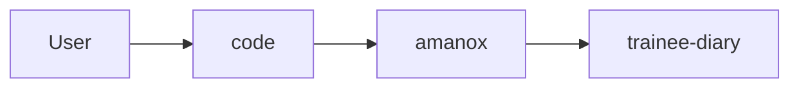

## Overview

Welcome to the team I wish you a great start and time at our company ❤️
In this post I will guide you on the setup of your trainee diary. 
In a later post I will share with you a guide and my expectations.
If you have any questions or you are stuck at something just get in touch with me.
Looking forward to work with you and no worry if you don't really understand everything which will be going on in this tutorial.
If you want to copy or use something of my blog post feel free to do it though attribution is appreciated.✌🏿



## Requirements
Befor you start make sure you fullfill all the requirements to start this guide otherwise it can cause problems.


<input type="checkbox"> 👉 Download a Packet Manager [For Windows](https://chocolatey.org) |[for Mac](https://www.brew.sh) 


<input type="checkbox"> 👉  [Have something where you can store you passwords](https://vault.bitwarden.com/#/register)


<input type="checkbox"> 👉 Have some portrait of you ready


<input type="checkbox"> 👉 [Create a Github account](https://www.github.com/join)


<input type="checkbox"> 👉 [Link your Github account with a Netlify account](https://app.netlify.com/signup) 


<input type="checkbox"> 👉 [Create a Gravatar/Wordpress account](https://en.gravatar.com) 


<input type="checkbox"> 👉 [Create a LinkedIn account](https://linkedin.com/signup) 


<input type="checkbox"> 👉 Have an editor or IDE installed an be familiar with [I recommend Visual Code](https://code.visualstudio.com) 


So now that you have everything let's start.

## Installation of Chocolatey
This part is only interesting for windows user.
Go to your search and tipp in **Windows Powershell** and then open it as an Administrator.


Then copy paste the following command into powershell.
```powershell
Set-ExecutionPolicy Bypass -Scope Process -Force; [System.Net.ServicePointManager]::SecurityProtocol = [System.Net.ServicePointManager]::SecurityProtocol -bor 3072; iex ((New-Object System.Net.WebClient).DownloadString('https://chocolatey.org/install.ps1'))
```
Use this to check if everything went fine.
```bash
choco
```

## Installation
First of all you need to [fork the Repo from wowchemy](https://app.netlify.com/start/deploy?repository=https://github.com/wowchemy/starter-academic&stack=cms).

After clicking on the link, you'll be greeted with the welcome screen.


Click the big Connect To Github button on the welcome screen (or alternatively click the link underneath to connect with Gitlab):


Login with your Github account 


Click Save & Deploy to create a repository for your site in Github:


Netlify will now generate your new site. Generally this takes around 1 to 5 minutes, but can take longer during busy periods. You’ll see the green “Published” notice appear under Production Deploys once it has completed.


You’ll notice that Netlify assign a free, random URL to the site. Let’s customize the URL to something more relevant. First click Site Settings:


Click Change site name…


Enter your site’s name, such as your name or organisation name, separating words with a hyphen (-) rather than a space.

Lastly, click Save to update our Netlify subdomain.

Awesome! We can now visit the site at the URL you chose!
Check your (GitHub) email to accept the invite to edit your site in the admin panel:


{}
If you can’t find the email,
* Go to **Settings > Identity**, and select **Enable Identity** service
* Under **Registration** preferences, select **Invite Only**
* Scroll down to **Services > Git Gateway**, and click **Enable Git Gateway**
  * This allows editors to write content without needing a GitHub account
* Head to the **Identity** tab at the top of the Netlify dashboard and then click the **Invite Users** button to invite yourself by entering your email address
{}

You will then be prompted to create a password:


Now you’re ready to edit your site in the CMS:


## Clone the Repository on your machine

Now let's get our hands dirty with git. Git is version control system and their are many Solutions out there to name a few Github, Gitlab, CodeCommit, etc. Initialy it was created by **Linus Torvald** (Father of Linux kernel) to help him and other people to collaborate on the development of the kernel code. The base software is open source. Git is widley used in the opensource community anyhow it is a basical skill which you will likely face at one point if you work in IT. So if you hear commit, branch, fork or repository it is always related to git.

Log you into your Github account and check if there was a new repository created. 
You should see something like <githubAccountNme/ogithubOrganizationName>/<repositoryname>


Next you should open an command line tool on your pc.


 On mac open the terminal and type in the following command:
```sh
homebrew install git golang hugo
```
{}
If you should use an mac with the new M1 you need to install go this way.
```sh
arch -arm64 brew install go       
```
{}
  On windows open powershell
```bash
choco install git golang hugo -confirm
```
After this steps all required tools are installed. But you can also install the [Github Desktop Version](https://desktop.github.com)
I recommend you to master the command line it is more convinient and indepentent. The next step will be to create an folder on your pc where we store our repositories.


Into your Github account navigate now into the newly created repository and copy the clone Link of the repository we will need it to create a local copy of the repository on your machine.


Now you go back to your already open console.
The following command are creating a simple folder structur in your user directory.

```bash
cd ~
mkdir code
cd code
mkdir amanox
cd amanox
git clone <Link to your repo>
```
{}
Passwordbased authentication for Github is deprecated so you need to generate an PAT (Personal Access Token)
and use it like a password.
[You can follow this tutorial here](https://docs.github.com/en/github/authenticating-to-github/keeping-your-account-and-data-secure/creating-a-personal-access-token)
Make sure you store it also in Bitwarden or the password tool of your choice.
{}

You can also choose a different structure if it fits your need better it is just a proposal.
Congrats you finished this part. 🙌
## Setup your CV
Open now **visual Code** an click on "open Folder"



Next you navigate to your Repository and open it.

{}
The root directory is the **first or top-most directory in a hierarchy**. It can be likened to the trunk of a tree, as the starting point where all branches originate from.
{}

The you should see a screen like this:

Now we are ready to edit trainee diary how we want.

### Remove unused parts

The first step that we will do is to get ride of all the stuff that we are not going to use. Here we have to possibilties how we can achieve this.
1. We can disable the unused parts with the active attribute.
2. We can delete the unused parts
I will go with the first option so i navigate into _content/home/_ where you can disable the following files _publications.md_ & _talks.md_ and type in the following code on the second line:
```markdown
active: false
```
The next step is to also remove the link from the navigation bar. Navigate to from your root foler to _config/_default/menus.yaml_ an in this file you remove the unwanted part. Then your file should look like this.
```markdown
main:
  - name: Home
    url: '#about'
    weight: 10
  - name: Posts
    url: '#posts'
    weight: 20
  - name: Projects
    url: '#projects'
    weight: 30
  - name: Contact
    url: '#contact'
    weight: 40
```
Befor you now can see some effect of your work you need to save your files and then make a local git commit and push it to the github repository. To do that use the following commands:
```bash
git add --all
git commit -m "My First commit"
git push
```
{}
It is always a good idea to give your commit an selfexplaining description so if you would need to go back or someone else wants to understand what you change it is self explaining which saves a lot of time.
{}
After you pushed your changes to the github repository lets login into our github account and check if everything worked out as planned.
In the red box you see the description of the last commit of the repository.

After that we can go to netlify to check if our changes go actual published to the world wide web.
If you didn't broke the syntax everything should be fine if you got an failure check if there is no typo in your files.
After you push a change you need to wait for 1-2minutes until it is live.

If you now access your page and scroll throw it you will see the content disappeared.

The next thing is to delete the demo post which is prebuild in our blog to do that we need to delete the following files you can delete it over the shell with the following command as you can see we can also manipulate the filesystem without the need of a mouse click. 
{}
Attention if you chose the wrong folder it will delete everything in this folder so be sure to chose the right one.
Be sure to start in the root directory of your project.
{}
```sh
rm -r content/post/getting-started
git add --all
git commit -m "Removed demo post"
git push
```
If you wan't you can check the result as you can see in this image below my demo post is gone on my diary.



You are awesome and finished the first part.🙌

### Edit the configuration of the webpage
In this part we are going to fill out your contact details, edit the localization and do some fine tuning.
So first you open again Visual Code and navigate to _config/default_ and open the _config.yaml_ file.
{}
_.yaml_ means **Yet Another Markup Language** mostly this files are used for configuration were data needs to be stored or transmitted.
It is also used to store a data structure or object stata which can later be processed. In yaml files the indentation is essential so keep an eye on that.
{}
When you open the file you will see a lot of option in the form of a key value pair. What do i mean with key value pair you might ask yourself.
Let's look at my example the _key_ title: which has the _value_ Portfolio so basically it it's a normal setting. 
Now we are going to change some of this _values_ or even add a complet _key/value pair_.
First thing we are going to change it the title of our site.
```yaml
title: Trainee diary
```
Next step is to also change the url to actual match your webpage. This is the url you defined in Netlify.
After that we are finished with this file.
```yaml
baseurl: <name>.netlify.app
```
Open now the _params.yaml_ file in this files you found everything which is strongly related to the wowchemy theme that we are using.
As a first step I you should update your contact details here. You should be able now to change that by yourself.
I still give you my code snippet as an example:
```markup
# Contact (edit or remove options as required)

email: fabian.brunner@windowslive.com
phone: +41 79 266 20 63
address:
  street: Dammweg 9
  city: Bern
  region: BE
  postcode: '3013'
  country: Switzerland
  country_code: CH
coordinates:
  latitude: '46.95639'
  longitude: '7.44676'
directions: Enter the Building and take the stairs to the Office on Floor 3
office_hours:
  - 'Monday-Friday 09:00 to 17:00'
appointment_url: 'https://calendly.com/fabian-brunner'
contact_links:
  - icon: twitter
    icon_pack: fab
    name: DM Me
    link: 'https://twitter.com/Twitter'
  - icon: discord
    icon_pack: fab
    name: Discord
    link: 'SwissFabru #4554'
```
After we filled out our contact details we are going to customize the localization of your wepage.
Look for the following key and change their values accordingly.
```markup
# Localization

date_format: 'Jan 2, 2006'
time_format: '15:04 CET'
address_format: de
```

Last put not least we are going to change the site feature settings. I summarized everything i changed in this code snippet.
Search your file with the shortcut on your keyboard, press the keys _ctrl_ + _f_ and type in the key which you are looking for.
```markup
highlight_languages:
  - r
  - bash
  - sh
  - powershell
  - markup
  - html
  - css
  - javascript
  - yaml
diagram: true
show_related:
  book: true
  page: false
  post: true
  project: true
  publication: false
  event: false
avatar:
  gravatar: true
  shape: circle
```
If you ask yourself what are these options all doing let me give you a brief explanation.
- The **highlight_languages** is were you can define which languages are marked and highlighted according to the language they belong to.
I used this featured a lot in this post thats all these tiny code sektion that i made for you.

- With the **diagram** option I enable you to use mermaid diagrams it is kind of a markup language which is generating diagrams.
- **show_related** defines which kind of recommendations you get in the footer of a post. Because we disabled some of these feature we also disable them in the recommendation.
- With the **gravatar** option we enable you to use the profile picture of gravatar.

{}
Don't forget to save your changes an then make a commit if you want to see it.
```bash
git add --all
git commit -m "Changed configuration files"
git push
```
{}

Finally let's take a look at our changes go to your webpage on _Contact_ and see if something changed.
If everything worked out you should see now your contact details on the page.

Congratulation you also finished this part.🙌

### Add your portrait and biography

### Add your skills

### add your experience

### add your accomplishments

### add an example project

## Write your first post

## Made it unique
Now it is your turn try to spice up your trainee diary and make it really unique so that i respresents a bit of your personality.
Try to implement one of the following things. I wish you good luck and I am looking forward to see the results of your work.
- add Languages
- use a custom theme
- add a welcome screen
- add animations
- add what ever comes to your mind

## Feedback
<iframe width="640px" height= "480px" src= "https://forms.office.com/Pages/ResponsePage.aspx?id=oxpfyxe2xUuIqoJ628auqDsJu6YOssZLtK_IOsuNRaRUMkZTMDk1OUxSMlpURktDM05YTUFKNDJVTi4u&embed=true" frameborder= "0" marginwidth= "0" marginheight= "0" style= "border: none; max-width:100%; max-height:100vh" allowfullscreen webkitallowfullscreen mozallowfullscreen msallowfullscreen> </iframe>

## Sources
- [Documentation of wowchemy](https://wowchemy.com/docs/content/docs/)
- [Documentation of Github](https://docs.github.com/en)
- [Documentation of Code Highlighting Liberary](https://highlightjs.org)
- [Documentation of Netlify](https://docs.netlify.com)
- [Mermaid diagrams in markuo](https://mermaid-js.github.io/mermaid/#/)
- [Github Account of Wowchemy](https://github.com/wowchemy)
- [Looking for cool free to use Pictures](https://unsplash.com)
- [Check out your Iconpack](https://fontawesome.com/v5.15/icons?d=gallery&p=1&m=free)
- [Tutorial and Referenz for html, css and js](https://www.w3schools.com)
- [Documentation of Hugo](https://gohugo.io/documentation/)